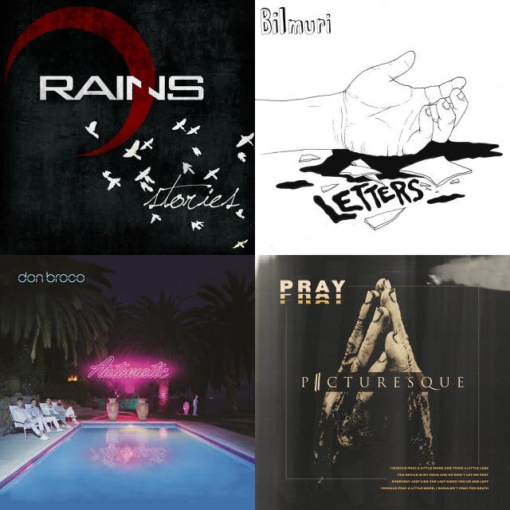
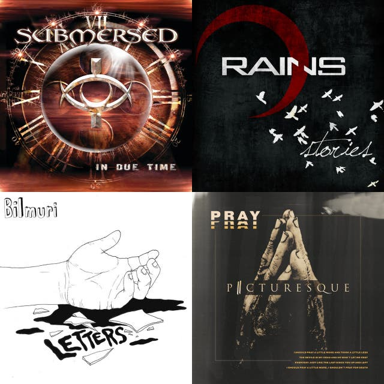

## Alt ∕ Rock
[start-desc]: #

[//]: # (Replace this line with a description persistent with the repository.)

[end-desc]: #

<a href="Ghost/songs.md"> <b>Ghost<b></a>|<a href="Non-English/songs.md"> <b>Non-English<b></a>|<a href="Alt/songs.md"> <b>Alt<b></a>
:--:|:--:|:--:
<a href="Rock/songs.md"> <b>Rock<b></a>|<a href="Alternative/songs.md"> <b>Alternative<b></a>|<a href="The New Alt/songs.md"> <b>The New Alt<b></a>
<a href="not rap/songs.md"> <b>not rap<b></a>|<a/>|<a/>

